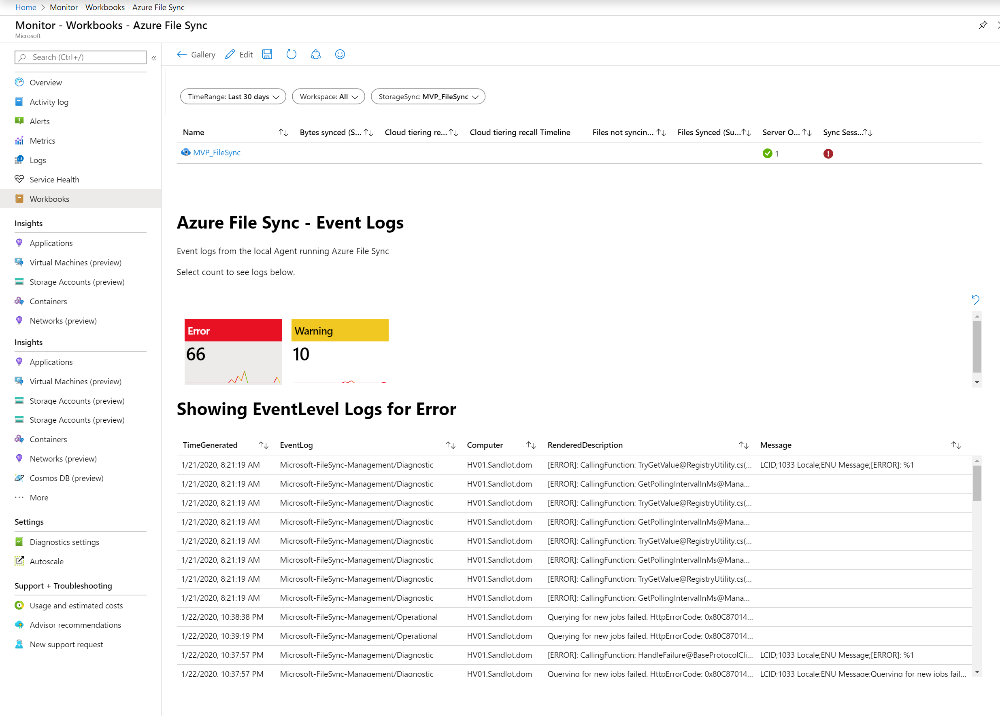

Azure File Sync Workbook
you can read the corresponding blog post here https://www.systemcenterautomation.com/2020/02/monitor-azure-file-sync-with-azure-monitor/

The workbook has three parameters, StorageSync, TimeRange and Workspaces. The workbook also pulls together the Storage Sync service with metrics and the Windows Event Logs we're collecting. The metrics contain heat map and line charts, I just haven't synched anything in a while.

